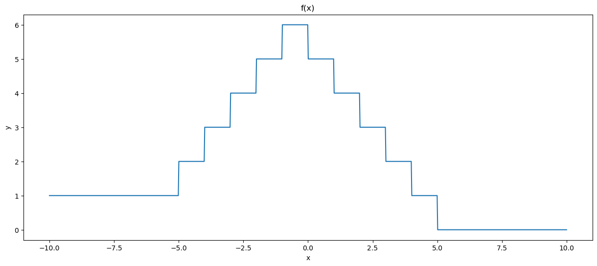
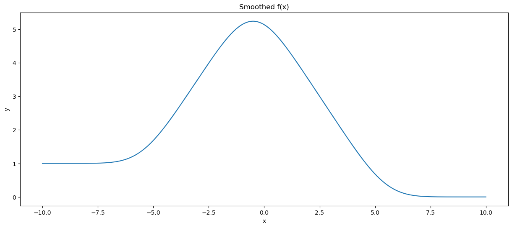
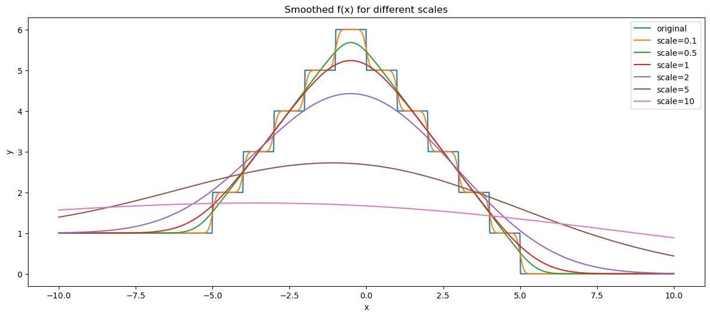
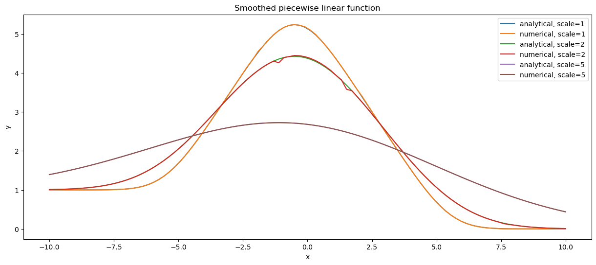
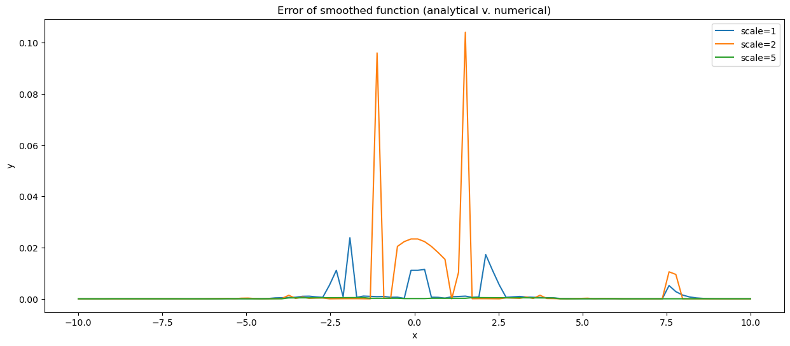

# Smooth Approximation with Gaussian Convolution

*Original project done as part of MATH-GA - 2048. All rights reserved.*

## Introduction

This repository focuses on computing smooth approximations of piecewise constant functions using Gaussian convolution. The technique finds applications in image blurring, function interpolation, and data smoothing.

## Mathematical Background

Given a function  $f$, we aim to find its smooth approximation through convolution with a Gaussian function,  $\varphi_s(t)$, defined as:

$$
\varphi_s(t) = \frac{1}{s \sqrt{2\pi}} e^{-\frac{1}{2} \left(\frac{t}{s} \right)^2}
$$

where  $s$ is the scale factor and  $F(x)$ is the cumulative distribution function (CDF) of  $\varphi_s(t)$.

For a piecewise constant function  $f$ (that takes the value $f_-$ before $x_0$, the values $f_i$ on $[x_i,x_{i+1}]$ and $f_+$ after $x_N$), the Gaussian convolution  $\tilde{f}(x)$ can be computed analytically as:

To express the convolution $\tilde{f}(x)$ of a function $f(x)$ with a Gaussian kernel $\varphi_s(x)$, we consider the following integral:

$$
\tilde{f}(x) = \int_{R} f(t) \varphi_s(x-t) \, dt
$$

This integral can be broken down into separate regions:

$$
\tilde{f}(x) = \int_{-\infty}^{x_0} f_- \varphi_s(x-t) \, dt + \sum_{i=0}^{N-1} \int_{x_i}^{x_{i+1}} f_i \varphi_s(x-t) \, dt + \int_{x_N}^{\infty} f_+ \varphi_s(x-t) \, dt
$$

Applying a change of variables $u = x - t$, we obtain:

$$
= f_- \int_{x-x_0}^{\infty} \varphi_s(u) \, du + \sum_{i=0}^{N-1} f_i \int_{x-x_{i+1}}^{x-x_i} \varphi_s(u) \, du + f_+ \int_{-\infty}^{x-x_N} \varphi_s(u) \, du
$$

Finally, expressing the integrals in terms of the cumulative distribution function $F(x)$ of the Gaussian distribution, we have:

$$
= f_-(1 - F(x-x_0)) + \sum_{i=0}^{N-1} f_i (F(x-x_i) - F(x-x_{i+1})) + f_+ F(x-x_N)
$$

Thus, we can write the convolution $\tilde{f}(x)$ using $F(x)$ and the constant values of $f$.

## Example

Consider the piecewise constant function  $f(x)$ defined as:

$$
f(x) =
\begin{cases}
\vdots\\
4 & \text{if } -3 \leq x < -2 \\
5 & \text{if } -2 \leq x < -1 \\
6 & \text{if } -1 \leq x < 0 \\
\vdots
\end{cases}
$$

Using the formula for  $\tilde{f}(x)$, we obtain its smoothed approximation as shown below (scale=1):

### Effect of Different Scales

## Performance Comparison

The analytical method significantly outperforms brute-force numerical convolution:

- 10x faster in computation
- Slighty better in terms of error

## Conclusion

The analytical method significantly outperforms brute-force numerical convolution in terms of both speed and precision. 

Additionally, further analysis yielded (see code) that it demonstrates comparable computational efficiency and error rates when benchmarked against FFT-based convolution methods from SciPy.

